# Content Intelligence Dashboard for AI Support Quality

## Overview

Designed and built an internal Streamlit dashboard for reviewing AI support bot quality issues, content gaps, expert feedback and recurring user query patterns in one place.

The dashboard was created for a CX automation context, where support bot interactions, manual reviews, and expert feedback needed to become easier to search, filter, and act on, especially for team members who needed a clearer review interface than raw BigQuery tables or overloaded spreadsheets.

It was primarily an analytics and review tool. LLM usage was introduced selectively, starting with translation of non-English queries to make multilingual bot issues easier to review.

## Problem

AI bot quality issues were spread across several places: bot logs exports, BigQuery tables, Telegram feedback, and manual reviews in the spreadsheets.

This made it difficult to answer practical questions like:

- Which bot responses need review?
- Which issues are recurring?
- Which questions point to missing or unclear content?
- Which answers were wrong, incomplete, unrelated, or hard to understand?
- Which issues came from expert feedback versus other review sources?
- What should be fixed first: content, prompts, routing logic, or data coverage?

The team needed a clearer way to collect these signals into one review workflow instead of jumping between raw tables, chat messages, and separate tracking files.

## Solution

Built a Streamlit dashboard that brought AI support quality signals into a more usable review interface.

The dashboard connected to BigQuery-backed data and made it easier to inspect bot interactions, filter issue types, review feedback, and identify patterns that could lead to content, prompt, or workflow improvements.

The goal was to build a practical internal tool that helped the team see what was going wrong and decide what to do next.

## Core functionality

- Issues table for reviewing bot quality problems in one place
- Analytics view for issue counts by channel and issue type
- Insights view for similar questions, and common keywords
- All conversations view for browsing bot conversations with translation support
- Filters for reviewing issues by source, date, issue type, review status, priority, reviewer, assignee and documentation status
- Support for connecting expert feedback and legacy spreadsheet notes to bot interaction data
- Review workflow for deciding whether a problem needs a content update, prompt change, routing fix, or further QA

## Data and review flow

1. Bot interaction data is stored in BigQuery.
2. Earlier manual review notes existed in spreadsheets from the previous tracking workflow.
3. New expert feedback is submitted in Telegram and stored in a separate BigQuery feedback table through the feedback bot.
4. Feedback and legacy review records are connected to the relevant bot/query records where possible.
5. The dashboard loads the review data into one interface.
6. Reviewers use the issues table, analytics, insights, and conversation views to inspect patterns.
7. Findings are used to guide content updates, prompt changes, routing improvements, or further QA.

## Dashboard structure

The diagram below shows the dashboard as a review layer on top of bot interaction data, expert feedback, and legacy spreadsheet review notes.

```mermaid
flowchart LR
    subgraph Inputs["Inputs"]
        A["Bot interaction data<br/>BigQuery"]
        B["Expert feedback table<br/>BigQuery"]
        C["Legacy review notes<br/>spreadsheets"]
    end

    subgraph Dashboard["Content Intelligence Dashboard<br/>Streamlit"]
        D["Issues table"]
        E["Analytics view"]
        F["Insights view"]
        G["All conversations view<br/>with translation support"]
    end

    subgraph Outputs["Follow-up"]
        H["Content updates"]
        I["Prompt changes"]
        J["Routing / workflow fixes"]
        K["QA checks"]
    end

    A --> D
    B --> D
    C --> D

    D --> E
    D --> F
    A --> G

    E --> H
    F --> H
    F --> I
    D --> J
    G --> K
```

## Status

The dashboard is an internal evolving work-in-progress tool rather than a polished production analytics product.

Some sections, especially analytics and insights, are still under active development. The value of the project is in creating a usable review layer over scattered bot quality data, not in presenting final BI-grade metrics.

## Roadmap / possible extensions

The dashboard is also a natural starting point for more automated follow-up workflows.

Planned or potential extensions included:

- **Semantic analysis of recurring issues:** cluster similar user queries and bot failures to identify repeated topics, content gaps, or routing problems across channels and languages.
- **Semantic issue grouping:** extend the existing Insights view from keyword/similar-query analysis into semantic clusters of recurring user questions and bot failures.
- **Documentation follow-up workflow:** allow reviewers to mark dashboard rows as `Needs documentation update` when there is enough evidence for a docs change.
- **Batch follow-up automation:** collect rows marked for documentation follow-up and create grouped GitHub issues on a regular schedule, avoiding one issue per individual example.
- **GitHub issue:** generate a structured GitHub issue or draft PR from the approved cluster, including representative user queries, expert notes, affected channels, issue type, and suggested documentation area.
- **LLM-assisted PR drafting:** in a later version, search the documentation repository, suggest the relevant file or section, draft a proposed edit, and open a pull request for human review.
