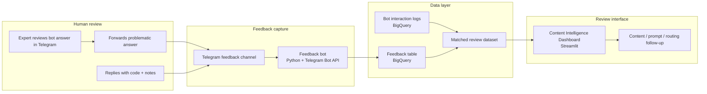

# Expert Feedback Workflow for AI Bot Quality

## Overview

Designed a lightweight human-in-the-loop workflow for capturing expert feedback on AI bot responses and turning that feedback into structured quality data.

The workflow allowed domain experts to flag problematic bot answers, classify the issue with a short code, add notes, and make the feedback available for review inside an internal quality dashboard.

## Problem

AI bot quality issues were being noticed by experts, but the feedback was difficult to collect consistently, compare across cases, and turn into systematic improvements. Initial feedback tracking was done manually by copy-pasting data from the messaging app (Telegram) community chats to Google spreadsheets.

The team needed an efficient way to keep track of problematic AI bot responses in order to be able to collect data that would answer questions like:

- Which bot answers are wrong, incomplete, or unrelated?
- Which issues are recurring?
- Which content or prompt areas need improvement?
- Which failures should be reviewed first?

## Solution

Created a workflow where experts could submit feedback in the tool they already used, using a short structured format.

The feedback was then parsed, stored as structured data, matched with existing bot interaction records, and presented in an internal dashboard for triage and improvement.

## Workflow

1. Expert identifies a problematic bot answer.
2. Expert forwards the answer to an internal feedback channel within the same app.
3. Expert replies with a short classification code and optional notes.
4. A feedback bot listening to the channel parses the reply.
5. Structured feedback is stored in a dedicated analytics table.
6. Feedback is matched with the original bot/query record.
7. Matched records appear in the quality dashboard.
8. The team uses the dashboard to prioritize content, prompt, and routing improvements.

## Feedback taxonomy

- `w` — wrong answer
- `i` — incomplete answer
- `u` — unrelated or off-topic answer
- `c` — correct answer, but needs formatting, tone, or clarity improvement

## Working approach

The workflow was designed around how experts were already behaving: they were reviewing bot answers in Telegram and manually copying problematic examples into spreadsheets.

Instead of asking people to adopt a completely new process, the goal was to keep the feedback step lightweight: forward the problematic answer, reply with a short code, and add notes only when needed.

The main work was in turning that simple action into usable data:

- defining a feedback taxonomy that was short enough for experts to use consistently
- making sure the feedback bot could listen to the feedback channel and parse replies
- storing feedback in a structured format instead of scattered spreadsheet rows
- matching feedback records to the original bot/query data
- making the reviewed examples visible in the quality dashboard
- using the collected issues to guide content, prompt, and routing improvements

## Result

The workflow reduced the amount of manual copy-pasting needed to track bot issues and made expert feedback easier to review later.

Instead of keeping examples in separate spreadsheets or chat messages, feedback could be collected in a consistent format and connected to the original bot interaction data.

This made it easier to spot repeated issues, review real examples, and decide whether a fix belonged in the content, prompt, routing logic, or broader bot behavior.

## Transferability

Any AI agent used in a business process needs a way for humans to flag failures, classify issues, and feed improvements back into the system.
The workflow pattern is reusable: capture human feedback in the tool people already use, structure it behind the scenes, connect it to the original record, and make it available for review.

## Tech stack

- Python
- Telegram Bot API
- GCP: Cloud Run for deployment, BigQuery for structured storage and matching
- Streamlit for dashboard review
